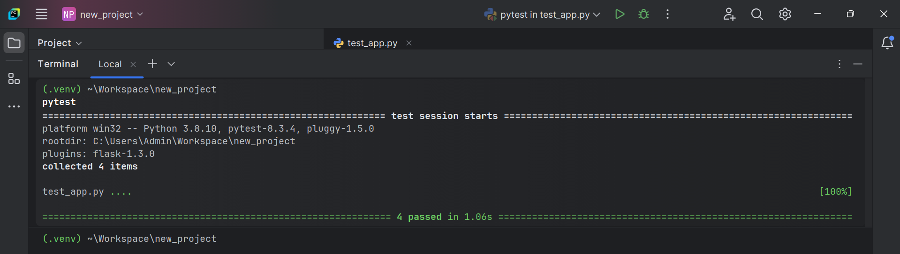
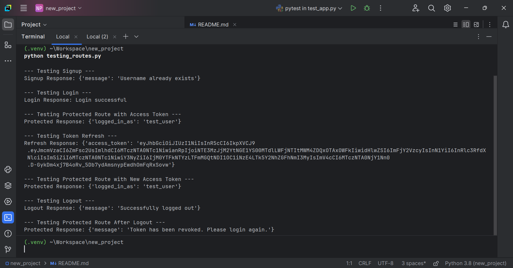

# Flask JWT Authentication API

A Flask-based API for user authentication using JSON Web Tokens (JWT). The project includes endpoints for signup, login, logout, token refresh, and a protected route.

## Features

- User signup with hashed passwords
- User login with access and refresh tokens
- Token refresh mechanism
- Logout with token blacklisting
- Protected routes accessible only with valid tokens
- Modular structure with Blueprints
- Environment variable configuration
- Testing using pytest

---

## Installation and Setup

### Prerequisites

- Python 3.8 or higher
- `pip` (Python package manager)

### Steps

1. Clone the repository:

   ```bash
   git clone https://github.com/jeetendra29gupta/flask-jwt-auth.git
   cd flask-jwt-auth
   ```

2. Create a virtual environment:

   ```bash
   python -m venv venv
   venv\Scripts\activate   # On Windows
   source venv/bin/activate  # On macOS/Linux
   ```

3. Install dependencies:

   ```bash
   pip install -r requirements.txt
   ```

4. Configure environment variables:
   
   Create a `.env` file and configure:

   ```plaintext
   SECRET_KEY=your_app_secret_key
   JWT_SECRET_KEY=your_jwt_secret_key
   DATABASE_URL=sqlite:///database.db
   ```

5. Start the application:

   ```bash
   python main_app.py
   ```

The application will be available at `http://127.0.0.1:8181`.

---

## API Endpoints

### Authentication

| Endpoint             | Method | Description                             |
|----------------------|--------|-----------------------------------------|
| `/api/signup`        | `POST` | Signup new users                       |
| `/api/login`         | `POST` | Login and get access/refresh tokens    |
| `/api/logout`        | `DELETE`| Logout and blacklist the access token |
| `/api/refresh`       | `POST` | Refresh an expired access token        |
| `/api/protected`     | `GET`  | Access protected route (JWT required)  |

---

## Testing

To run test cases:

1. Install `pytest`:

   ```bash
   pip install pytest pytest-flask
   ```

2. Run the tests:

   ```bash
   pytest
   ```
3. Test coverage includes:
- User signup, login, and logout
- Token refresh
- Protected route access


---

## Example Usage

### 1. Signup

```bash
curl -X POST http://127.0.0.1:8181/api/signup \
  -H "Content-Type: application/json" \
  -d '{"username": "test_user", "password": "password123"}'
```

### 2. Login

```bash
curl -X POST http://127.0.0.1:8181/api/login \
  -H "Content-Type: application/json" \
  -d '{"username": "test_user", "password": "password123"}'
```

Response:
```json
{
  "access_token": "ACCESS_TOKEN",
  "refresh_token": "REFRESH_TOKEN"
}
```

### 3. Access Protected Route

```bash
curl -X GET http://127.0.0.1:8181/api/protected \
  -H "Authorization: Bearer ACCESS_TOKEN"
```


---
